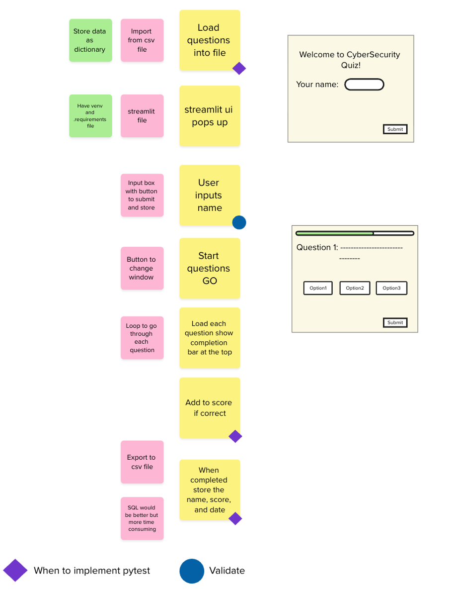
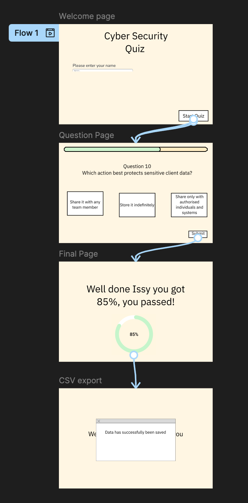

# IBM's Cyber Security Quiz for Employees

## Order of Documentation
1. [Introduction](#introduction)
2. [Design](#design)
 
    2.1 [Initial design](#initial-design)
 
    2.2 [Figma design](#figma-design)
 
    2.3 [Requirements](#requirements)
 
    2.4 [Tech Stack Outline](#tech-stack-outline)
 
    2.5 [Code Design](#code-design)
 
3. [Development](#development)
4. [User Documentation](#user-documentation)
5. [Technical Documentation](#technical-documentation)
6. [Evaluation](#evaluation)

# Introduction
Modern workplace environments increasingly rely on strong digital security practices to protect organisational data, maintain client trust, and comply with regulatory requirements. As companies continue to adopt cloud‑based workflows, distributed teams, and complex technical systems, the risk of security breaches has grown significantly. Employees now play an essential role in safeguarding information assets, as human error remains one of the most common causes of security incidents. Creating a culture of security awareness is therefore critical to ensuring that staff can recognise threats, follow best practices, and understand their responsibilities.  
Within IBM, where teams handle sensitive client data, intellectual property, and internal systems, the need for consistent and measurable security knowledge is particularly important. Security expectations apply to everyone, not just technical teams, and even small mistakes—such as mishandling credentials, falling for phishing attempts, or misconfiguring access permissions—can lead to serious consequences. Ensuring that employees remain informed and confident in their security understanding helps reduce these risks and supports IBM’s wider commitment to maintaining industry‑leading security standards.  
The proposed MVP directly supports this need by providing a simple, interactive quiz designed to assess employees’ security knowledge in an accessible way. By delivering short, focused questions on core security topics, the tool helps identify individuals who may require additional training. The quiz results can be reviewed by managers, allowing them to offer targeted support and ensure their teams maintain expected security competencies. This not only strengthens the organisation’s overall security posture but also builds accountability and awareness across the workforce. The MVP therefore offers a practical, lightweight method for supporting IBM’s ongoing security efforts while giving employees an engaging way to test and improve their understanding.

# Design 

## Initial Design 
To help me ideate with my ideas for the app, I first created a mural to act as a 'brain dump' to help me plan out what my program will include and when, this is represented by the image below:

## Figma Design
To Design what my interface would look like, I created a Figma prottype with the main screens that will be on my interface, as well as the flows between them: 

## Requirements
### Function Requirements 
> 
>
>

### Non-Functional Requirements
>
>
>

## Tech Stack Outline
My backend code is using **Python**, this is what I have been using this module and I am comfortable coding with it but also want to experience importing the classes or functipns as it is somehting I would use in work.

To create my GUI, I decided to use **Streamlit**. At first I was going to use Tkinter as I have some previous use of coding with it. However, what changed my mind was after speaking with people I work with they recommend I use Streamlit as it is something they have sometimes used in work and would be useful to understand.

## Code Design

# Development

# Testing

# User Documentation

# Technical Documentation

# Evaluation