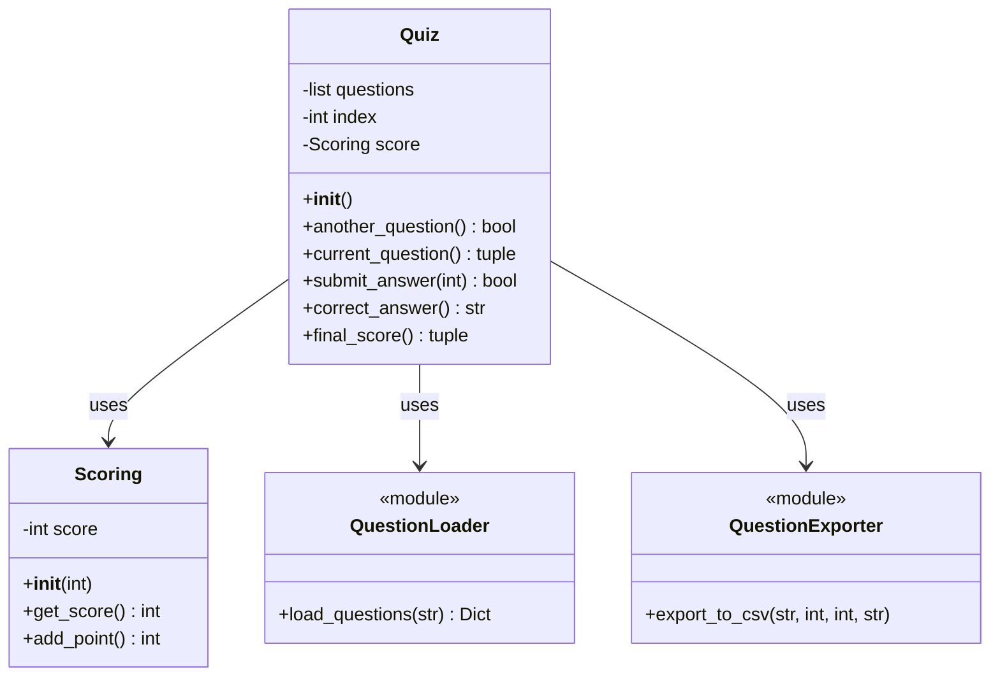

# IBM's Cyber Security Quiz for Employees

## Order of Documentation
1. [Introduction](#introduction)
2. [Design](#design)
<br>
    2.1 [Initial design](#initial-design)
<br>
    2.2 [Figma design](#figma-design)
<br>
    2.3 [Requirements](#requirements)
<br>
    2.4 [Tech Stack Outline](#tech-stack-outline)
<br>
    2.5 [Code Design](#code-design)
<br>
3. [Development](#development)
4. [User Documentation](#user-documentation)
5. [Technical Documentation](#technical-documentation)
6. [Evaluation](#evaluation)

# Introduction

Modern workplace environments have to handle the new rises in technology, but also new ways of security to ensure their data is protected. They must meet client trust and regulation requirements. However, the risk of security breaches has grown significantly with the more complex technical systems. Employees are now really important in safeguarding the data, as human error remains one of the most common causes of security incidents. Companies must now make a culture of security awareness so staff can recognise threat and follow best practices.<br><br>
In IBM, an example of what teams handle are:
- Sensitive client data
- Intellectual property
- Internal Systems 
This means that they must have high knowledge on security, everyone in the team not even just technical teams as small mistakes can lead to serious consequences. Ensuring that employees remain cofident in their security understanding helps lower risks to support IBM's commitment to maintaining high standards.<br><br>
This proposed solution (MVP) supports this need by providing a training quiz for employees to consolidate their security knowledge. It consists of cyber security questions, where the user must get over 80% to pass, and if not have to retake the quiz until they get that score. This ensures that employees have a high knowledge that IBM need, with managers being able to review their results. The MVP therefore offers a practical, lightweight method for supporting IBM’s ongoing security efforts while giving employees an engaging way to test and improve their understanding.

# Design 

## Initial Design 
To help me ideate with my ideas for the app, I first created a mural to act as a 'brain dump' to help me plan out what my program will include and when. This helped me plan my code and what I needed to implement to ensure it was structured correctly. This is represented by the image below:


## Figma Design
To Design what my interface would look like, I created a Figma prototype with the main screens that will be on my interface, as well as the flows between them. I chose to have a simple interface that is user-friendly to make the quiz almost seem 'gamified', as studies show 85% of employees are shown to be more engaged when gamification solutions are applied to their workplace. ([Article here](https://www.growthengineering.co.uk/19-gamification-trends-for-2022-2025-top-stats-facts-examples/))


## Requirements
### Functional Requirements 
1. Load Questions into Python<br>
1.1 From a JSON File<br>
1.2 Dictionary Format<br>
1.3 Data Structure passes Pytest<br>
1.4 Error Handling during load<br>
1.4.1 Display message if file can't be read<br>
1.4.2 Display message if file is empty or not in right data format<br>
2. Have a GUI<br>
2.1 GUI Implemented using streamlit<br>
2.1.1 Welcome screen<br>
2.1.2 Question screen<br>
2.1.3 Results are shown<br>
3. User Input<br>
3.1 User must enter name<br>
3.2 Inout must not be empty<br>
4. Quiz Flow<br>
4.1 Iterate through each question<br>
4.2 Questions are presented in a random order<br>
5. Scoring<br>
5.1 Calculate score<br>
5.1.1 +1 per correct answer<br>
5.1.2 Convert score to percentage<br>
5.1.3 80% or higher is a pass<br>
6. Data Export<br>
6.1 Export quiz results<br>
6.1.1 Export name, score, and date<br>
6.1.2 Export results to a CSV file<br>
6.1.3 Support dictionary format<br>

### Non-Functional Requirements
1. Performance<br>
1.1 Application loads within 5 seconds<br>
1.2 Quiz interactions respond without noticeable delay<br>
2. Usability<br>
2.1 Display feedback per question<br>
2.1.1 Indicate if answer is correct<br>
2.1.2 Indicate if answer is incorrect<br>
2.1.3 Display the correct answer when incorrect<br>
3. Progress Visibility<br>
3.1 Display quiz progress<br>
3.1.1 Progress bar shown at top of screen<br>
3.1.2 Progress updates after each question<br>
4. Reliability<br>
4.1 Application must not crash on invalid input<br>
4.2 Errors handled gracefully with user-friendly messages<br>
5. Maintainability & Testability<br>
5.1 Code is readable and well structured<br>
5.2 Core logic is testable using PyTest<br>


## Tech Stack Outline
My backend code is using **Python**, this is what I have been using this module and I am comfortable coding with it but also want to experience importing the classes or functions as it is something I would use in work.

To create my GUI, I decided to use **Streamlit** because it allowed rapid development and simplified deployment, which aligned with my MVP goal. At first I was going to use Tkinter as I have some previous use of coding with it. However, what changed my mind was after speaking with people I work with they recommend I use Streamlit. 

## Code Design

## Class Diagrams

### Backend class diagram

To plan what my code will look like and how each module will interact with each other I have created a mermaid class diagram.

The main class used is Quiz, this handles the main quiz engine functions. It checks the what the current question is and if there is another question, as well as if the answer was correct and if not then what it was.

There is another class to handle scoring, adding a point then displayong the point. 

There is then 2 classes to load and export the question JSON file.


```mermaid
classDiagram
    class Quiz {
        -list questions
        -int index
        -Scoring score
        +__init__()
        +another_question() bool
        +current_question() tuple
        +submit_answer(int) bool
        +correct_answer() str
        +final_score() tuple
    }
    
    class Scoring {
        -int score
        +__init__(int)
        +get_score() int
        +add_point() int
    }
    
    class QuestionLoader {
        <<module>>
        +load_questions(str) Dict
    }
    
    class QuestionExporter {
        <<module>>
        +export_to_csv(str, int, int, str)
    }
    
    Quiz --> Scoring : uses
    Quiz --> QuestionLoader : uses
    Quiz --> QuestionExporter : uses
```
The backend code will then be imported into my frontend to be use with the components.

# Development

The next section will explain the technical aspects of my code, and how each component works together.

## Project Structure

The application follows a modular architecture with clear separation of logic, this ensures that my logic is separate to the main GUI:

```
Employer-Quiz/
├── app.py                    # First screen (welcome screen)
├── questions.json            # Quiz question data file
├── requirements.txt          # Python dependencies
├── backend/                  # Core logic
│   ├── question_loader.py    # Loads questions from JSON
│   ├── quiz_engine.py        # Main quiz logic
│   ├── scoring.py            # Score management
│   └── question_exporter.py  # CSV exporter
├── pages/                    # Streamlit pages
│   ├── quiz.py              # Quiz interface
│   └── widgets.py           # UI helper functions
└── testing/                 # Tests
    ├── test_scoring.py
    ├── test_load_questions.py
    └── test_smoke_test.py
```

## Core Components

### Entry Point ([`app.py`](app.py))

The application starts with a simple welcome screen that collects the user's name:

```python
import streamlit as st
from pages.widgets import hide_toolbar
from backend.question_loader import load_questions

hide_toolbar()

st.title("Welcome to IBM's Cyber Security Quiz!")

user_name = st.text_input("Your name: ")

if user_name:
    st.write(f"Hello {user_name}, please press enter when you are ready...")
    st.session_state['username'] = user_name

    switch_page = st.button("Start")
    if switch_page and user_name:
        st.switch_page("pages/quiz.py")
```

- Input validation means that users cannot proceed without entering a name
- Uses Streamlit's session state to access the user's name across different pages
- Hides the sidebar navigation to ensure user can't navigate themselves

### Question Loading ([`backend/question_loader.py`](backend/question_loader.py))

This module handles loading questions from the JSON file with comprehensive error handling:

```python
import json
from typing import Dict, Any

def load_questions(path: str) -> Dict[int, Any]:
    """
    Loads questions from a JSON file and return them indexed by position.
    
    If the file is empty or had whitespace only it is invalid.
    Only lists and dictionaries in the file is allowed.
    If the file cannot be found an exception is placed to show the user the error.
    If the file is found but has invalid JSON, then such error is also displayed.
    """
    try:
        with open(path, "r", encoding="utf-8") as file:
            raw_data = file.read()
            
            if raw_data.strip() == "":
                print("invalid JSON in questions file")
                return None
                
            data = json.loads(raw_data)  
            
        if isinstance(data,list):
            return {i: q for i, q in enumerate(data)}
        if isinstance(data,dict):
            return data
    
    except FileNotFoundError:
        print("File not found")
        return None
    
    except json.JSONDecodeError:
        print("invalid JSON in questions file")
        return None
```

- Validates file existence and JSON format
- Handles empty files 
- Ensures dictionary structure is used
- Returns None on errors with a message to describe

### Scoring System ([`backend/scoring.py`](backend/scoring.py))

A simple class-based approach to manage quiz scores:

```python
class Scoring:
    """
    The class scoring is created to handle the user's points in the quiz engine.
    """
    def __init__(self, score: int):
        """
        Initialises score
        """
        self.score = score
    
    def get_score(self):
        return self.score
    
    def add_point(self) -> int:
        self.score +=1 
        return self.score
```
I chose to add the scoring system as a separate function because it encapsulates the score state and 
provides controlled access.

### Quiz Engine ([`backend/quiz_engine.py`](backend/quiz_engine.py))

This is the core logic that handles the main quiz flow:

```python
from .question_loader import load_questions
from .scoring import Scoring

class Quiz:
    """
    Class to handle quiz functions 
    """
    def __init__(self):
        """
        Initialises the questions, options, and answers
        As well as the number on and score using class imported from scoring
        """
        data = load_questions("questions.json")
        self.questions = list(data.values())
        self.index = 0
        self.score = Scoring(0)

    def another_question(self):
        """
        Checks if there is another question and not at the end of list
        """
        if self.index < len(self.questions):
            return True
        else:
            return False

    def current_question(self):
        """
        Returns the current question, options, index and the length of questions
        """
        if self.index >= len(self.questions):
            return None
        else:
            q = self.questions[self.index]
            return q["question"], q["options"], self.index + 1, len(self.questions)

    def submit_answer(self, answer: int):
        """
        Checks if answer is correct when submitted
        """
        question = self.questions[self.index]
        correct = (answer == question["answer"])
        if correct:
            self.score.add_point()
        self.index += 1
        return correct

    def correct_answer(self):
        """
        Shows what the correct answer is if the user got the answer wrong
        """
        previous = self.index - 1
        if previous < 0:
            return ""
        question = self.questions[previous]
        return question["options"][question["answer"]]

    def final_score(self):
        """
        Returns final score
        """
        return self.score.get_score(), len(self.questions)

```

- Manages question iteration and state
- Validates answers and updates scores
- Provides access to correct answers for feedback
- Tracks progress through the quiz

### Results Export ([`backend/question_exporter.py`](backend/question_exporter.py))

Exports quiz results to CSV for the user's manager to review:

```python
import csv
from pathlib import Path

def export_to_csv(username: str, score: int, total: int, filepath: str = "quiz_results.csv"):
    """
    Exports user results to a csv file
    
    Writes a row containing username, score, total, percentage, and PASS/FAIL
    status (PASS if percentage >= 80) to ``filepath``. Creates the file and
    header row if it does not already exist.
    """
    percentage = (score / total) * 100
    if percentage >= 80:
        pass_status = "PASS"
    else:
        pass_status = "FAIL"
    
    file_exists = Path(filepath).exists()
    
    with open(filepath, 'a', newline='', encoding='utf-8') as file:
        writer = csv.writer(file)
        if not file_exists:
            writer.writerow(['Username', 'Score', 'Total', 'Percentage', 'Status'])
        writer.writerow([username, score, total, f"{percentage:.1f}%", pass_status])
```

- Calculates percentage and pass/fail status
- Creates CSV with headers if file doesn't exist
- Appends results to existing file for historical tracking
- Uses Path library for cross-platform compatibility

### Quiz Interface ([`pages/quiz.py`](pages/quiz.py))

The main quiz interface manages the user experience:

**Streamlit State Management:**
```python
# Initialises state session once per user session
if "quiz" not in st.session_state:
    st.session_state.quiz = Quiz()
if "next_question" not in st.session_state:
    st.session_state.next_question = False
if "feedback" not in st.session_state:
    st.session_state.feedback = ""
```

**Progress Tracking:**
```python
if total == 0:
    progress_fraction = 0
else:
    progress_fraction = min(completed, total) / total
    
st.progress(progress_fraction)
st.caption(f"Progress: {min(completed, total)}/{total}")
st.write(f"Score: {score} / {total}")
```

**Answer Submission:**
```python
if submit:
    answer_index = options.index(answer)
    is_correct = quiz.submit_answer(answer_index)
    if is_correct:
        st.session_state.feedback = "Correct!"
    else:
        st.session_state.feedback = ("Wrong! The correct answer is: " + quiz.correct_answer())
    st.session_state.next_question = True
    st.rerun()
```

**Key Features:**
- Progress bar and score display
- Feedback on answer correctness
- Shows correct answer when user is wrong
- 80% pass 
- Retake quiz if failed
- CSV export 

### UI Customization ([`pages/widgets.py`](pages/widgets.py))

Helper function to control navigation:

```python
def hide_toolbar():
    """
    This function removes the toolbar in the streamlit page.
    This ensures that the user can't go between the pages by themselves.
    """
    st.markdown(
    """
    <style>
    [data-testid="stSidebar"] {
        display: none !important;
    }
    </style>
    """,
    unsafe_allow_html=True,
)
```

- Hides Streamlit's default sidebar navigation
- Users have to follow the intended quiz flow

## Object-Oriented Design

 chose OOP because the quiz has distinct responsibilities that help being modelled as separate classes with controlled interfaces

1. **Encapsulation**: [`Scoring`](backend/scoring.py:6) class encapsulates score state.
Scoring encapsulated the score state so scoring can only be modified by add_point() and get_point(), preventing the quiz engine
from directly changing the score, this helps reduce bugs.

2. **Composition**: [`Quiz`](backend/quiz_engine.py:9) class uses Scoring object
The Quiz class owns a Scoring instance ``(self.score = Scoring(0))``, meaning scoring logic dedicated to an object rather than handled directly inside Quiz. This keeps each class focused on a single responsibility.

3. **Single Responsibility**: Each class has one clear purpose
This helps readbility of code, and also separates the logic meaning it is easier to read the code and also to use.

# Testing

## Testing Strategy
My testing approach for this project involved automated unit testing, manual testing, and continuous integration.

I wrote my automated unit tests using PyTest to validate the core backend logic, such as score calculation and question loading. These tests focus on predictable behaviour and ensure that given the same inputs, the same outputs are returned. This was important because the quiz engine contains the core business logic and needs to behave consistently.

Manual testing was used for the GUI components, as Streamlit interfaces are not easily unit tested. This involved running the application and validating user flows such as name input validation, quiz progression, result calculation, and CSV export.

In addition, GitHub Actions was configured to automatically run the test suite on each commit. This continuous integration setup ensures that changes do not introduce regressions and reflects professional development practices used in industry.

These tests all help ensure that my requirements are met.

## Automated tests

#### 1. [`test_scoring.py`](testing/test_scoring.py) - Score Management Tests

```python
def test_score_setup():
    score = Scoring(0)
    assert score.get_score() == 0
    
    score = Scoring(7)
    assert score.get_score() == 7

def test_addpoint():
    score = Scoring(0)
    assert score.add_point() == 1
```

**Tests:**
- Score initialization with different values
- Point addition functionality
- Score retrieval accuracy

#### 2. [`test_load_questions.py`](testing/test_load_questions.py) - Data Loading Tests

```python
def test_load_questions_true():
    result = load_questions("questions.json")
    assert result
    assert isinstance(result, dict)
    
def test_load_questions_false():
    assert load_questions("test.json") is None
    assert load_questions("blank.json") is None
```

**Tests:**
- Successful loading of valid JSON file
- Returns dictionary format
- Handles missing files gracefully
- Handles invalid files gracefully

All tests ran in pytest have successfully passed for my code.

The GitHub Actions workflow ([`.github/workflows/python-app.yml`](.github/workflows/python-app.yml)) runs automatically on every commit.

## Manual Testing Results

The following table documents manual testing of all functional requirements:

## Manual Testing Results

| Test ID | Requirement Group | Test Description | Method | Expected Result | Actual Result | Screenshot |
|---------|-------------------|-----------------|--------|----------------|---------------|---------------|
| FR1 | Question Loading & Validation | Verify questions load correctly from JSON and handle invalid files | Ran application with valid, missing, and invalid JSON files | Valid file loads correctly- missing/invalid file handled gracefully | Pass |  |
| FR2 | GUI & Navigation | Verify welcome screen, quiz screen, and results screen display correctly | Completed full quiz flow | All screens render correctly and navigation flows as intended | Pass |  |
| FR3 | Input Validation | Ensure user cannot proceed without entering a name | Attempted to click Start without input | Application prevents progression | Pass |  |
| FR4 | Quiz Flow & Progress Tracking | Confirm questions iterate correctly and progress bar updates | Completed full quiz attempt | Questions display sequentially; progress and score update accurately | Pass |  |
| FR5 | Scoring & Pass Threshold | Validate scoring logic and 80% pass requirement | Tested quiz with scores above and below 80% | Correct score calculation and pass/fail status | Pass |   |
| FR6 | Data Export | Confirm results are exported to CSV with correct fields | Completed quiz and inspected output file | CSV created with username, score, percentage, and status | Pass | N/A |
| NFR1 | Performance | Confirm application loads and responds quickly | Measured load time and interaction response | Application loads within 5 seconds and responds instantly | Pass | N/A |
| NFR2 | Reliability & Error Handling | Test invalid inputs and edge cases | Triggered missing files and incorrect inputs | Application remains stable and displays user-friendly errors | Pass |  |

**If images don't load correctly in testing table please go to the images file to access :)**

### Future Improvements for Testing:
- Add some integration tests for full quiz flow
- Add UI testing with Selenium 
- Increase edge case coverage<br>
<br>

# User Documentation

Here is how you can access the Cyber Security Quiz as an employee.

### Prerequisites
- Access to the quiz application (https://employer-quiz-foundationsofprogramming.streamlit.app/)
- A web browser (Chrome, Firefox, Safari, or Edge)
- 5-10 minutes to complete the quiz

### Accessing the Quiz
1. Open your web browser
2. Navigate to the quiz URL provided by your manager
3. Wait for the welcome screen to load

## Taking the Quiz

### Step 1: Enter Your Name

1. On the welcome screen, you'll see a text input field labeled "Your name:"
2. Type your full name (e.g., "John Smith")
3. Press Enter to reveal start button
4. Click the **Start** button to begin

**Note:** You cannot proceed without entering your name.

### Step 2: Answer Questions

For each question:

1. **Read the question** carefully at the top of the screen
2. **Review all options** - there are typically 3 choices
3. **Select your answer** by clicking the radio button next to your choice
4. **Click Submit** to confirm your answer

### Step 3: Review Feedback

After submitting each answer:

- **Correct Answer**: You'll see "Correct!" in green
- **Incorrect Answer**: You'll see "Wrong! The correct answer is: [answer]" in red

Click **Next question** to continue.

### Step 4: Track Your Progress

Throughout the quiz, you can monitor:

- **Progress Bar**: Visual showing the completion percentage
- **Progress Counter**: Text showing "Progress: X/10"
- **Current Score**: Displays "Score: X / 10"

### Step 5: View Results

After completing all questions:

#### If You Pass (80% or higher):
- You'll see your final score
- Click **Submit results** to save your score
- Your results will be recorded for your manager to review

#### If You Don't Pass (below 80%):
- You'll see your score and a message indicating you need to retake the quiz
- Click **Redo** to start again

# Technical Documentation

This guide provides technical information for developers, testers, and system administrators working with the IBM Cyber Security Quiz application.

## System Requirements

### Development Environment
- **Python Version**: 3.9 or higher (tested on 3.10)
- **Operating System**: Windows, macOS, or Linux
- **RAM**: Minimum 2GB
- **Disk Space**: 100MB for application and dependencies

### Dependencies
See [`requirements.txt`](requirements.txt):
```
streamlit
```


## Installation

### 1. Clone the Repository

```bash
git clone https://github.com/your-org/Employer-Quiz.git
cd Employer-Quiz
```

### 2. Create Virtual Environment (Recommended)

```bash
# macOS/Linux
python3 -m venv venv
source venv/bin/activate
```

### 3. Install Dependencies

```bash
pip install -r requirements.txt
```

## Running the Application

### Local Development

```bash
streamlit run app.py
```

The application will open in your default browser at `http://localhost:8501`

### Production Deployment

For production deployment, consider:

1. **Streamlit Cloud**: Deploy directly from GitHub
2. **Docker**: Containerize the application
3. **Cloud Platforms**: AWS, Azure, or Google Cloud

## Code Structure

### Module Descriptions

#### [`app.py`](app.py)
- **Purpose**: Application entry point
- **Responsibilities**: Welcome screen, name collection, navigation
- **Key Functions**: None (main script)

#### [`backend/question_loader.py`](backend/question_loader.py)
- **Purpose**: Load and validate quiz questions
- **Key Function**: `load_questions(path: str) -> Dict[int, Any]`
- **Returns**: Dictionary of questions indexed by position
- **Error Handling**: FileNotFoundError, JSONDecodeError

#### [`backend/scoring.py`](backend/scoring.py)
- **Purpose**: Manage quiz scoring
- **Key Class**: `Scoring`
- **Methods**:
  - `__init__(score: int)`: Initialize with starting score
  - `get_score() -> int`: Retrieve current score
  - `add_point() -> int`: Increment score by 1

#### [`backend/quiz_engine.py`](backend/quiz_engine.py)
- **Purpose**: Core quiz logic and state management
- **Key Class**: `Quiz`
- **Methods**:
  - `__init__()`: Load questions and initialize state
  - `another_question() -> bool`: Check if more questions exist
  - `current_question() -> tuple`: Get current question data
  - `submit_answer(answer: int) -> bool`: Process answer submission
  - `correct_answer() -> str`: Get correct answer text
  - `final_score() -> tuple`: Get final score and total

#### [`backend/question_exporter.py`](backend/question_exporter.py)
- **Purpose**: Export quiz results to CSV
- **Key Function**: `export_to_csv(username, score, total, filepath)`
- **Output Format**: CSV with headers: Username, Score, Total, Percentage, Status

#### [`pages/quiz.py`](pages/quiz.py)
- **Purpose**: Main quiz interface
- **Responsibilities**: Display questions, handle input, show feedback, manage flow
- **State Management**: Uses Streamlit session_state

#### [`pages/widgets.py`](pages/widgets.py)
- **Purpose**: UI helper functions
- **Key Function**: `hide_toolbar()` - Hides Streamlit sidebar

## Configuration

### Streamlit Configuration

Configuration file: [`.streamlit/config.toml`](.streamlit/config.toml)

```toml
[theme]
primaryColor = "#0f62fe"
backgroundColor = "#ffffff"
secondaryBackgroundColor = "#f4f4f4"
textColor = "#161616"
font = "sans serif"
```

### Question Data Format

Questions are stored in [`questions.json`](questions.json):

```json
[
  {
    "question": "Question text here?",
    "options": ["Option 1", "Option 2", "Option 3"],
    "answer": 0
  }
]
```

**Fields:**
- `question` (string): The question text
- `options` (array): List of possible answers
- `answer` (integer): Index of correct answer (0-based)

## Adding New Questions

1. Open [`questions.json`](questions.json)
2. Add new question object to the array:

```json
{
  "question": "Your new question?",
  "options": ["Answer 1", "Answer 2", "Answer 3"],
  "answer": 1
}
```

3. Save the file
4. Test locally: `streamlit run app.py`
5. Commit and push changes

## Modifying Pass Threshold

Current threshold: 80%

To change, edit [`pages/quiz.py`](pages/quiz.py:35):

```python
if score / total * 100 < 80:  # Change 80 to desired percentage
```

# Evaluation

## What Went Well

Overall I am really happy with my structure, I tried to use frontend and backend files to separate code and make it easier to read. I also did this to reflect how my team structure files i n our projects. I think I managed to do this successfully, but maybe with some improvements in the frontend part as that is the bit I have less technical experience in. I'm also happy with my use of streamlit, it means I was able to deploy the application with also the session state management allowing the quiz to flow well. I believe that when looking at the application it looks decent and has lots of opportunity to grow. 


## Areas for Improvement

Since this is just a short project, there are many things I would further wish to implement. For example, randomizing the order of the questions and options, this could be done using ``randint``. This would ensure that employees can't remember the order of the answers. 

The biggest change I would implement is using a database as storage. It is more industry standard and provides more opportunities:
- Better security
- Better write protection
- Use of queries
- Data validation
- User authentication
- Understanding of which manager needs what data

Another change I would add is more accessibility, such as testing with screen readers and keyboard-only navigation. Also, more analysis, this could be done using AI to find patterns in most common wrong answers and recommendations of what training to look at.

## Lessons Learned
- A peer review process would have identified implementation gaps
- The Figma design phase saved significant development time by clarifying requirements upfront
- Streamlit's rapid development capabilities were perfect for this MVP, validating the importance of choosing appropriate tools
- The structured requirements list (FR1, FR1.1, etc.) made testing systematic and comprehensive
- Building and testing one feature at a time prevented overwhelming complexity
- Writing documentation alongside code kept it accurate and complete
- Setting up GitHub Actions from the start caught issues immediately rather than at the end

## Conclusion

Overall, I am really happy with this turned out. I feel like I have really developed my technical skills by separating logic and also deploying my application on streamlit. I would have loved to add more but due to my already learning of streamlit (especially the sessions) nI didn't have time to produce these changes to also learn more about database handling in python. Thank you for reading!

## Documentation
- [Streamlit Documentation](https://docs.streamlit.io/) - Streamlit Official Docs
- [PyTest Documentation](https://docs.pytest.org/) - PyTest Official Docs
- [GitHub Actions Documentation](https://docs.github.com/en/actions) - GitHub Docs